# 03_PENGENALAN DART

## GUIDED
### A. Variabel
Pada bagian ini, kita belajar tentang cara mendeklarasikan dan menginisialisasi variabel di Dart. Dalam contoh ini, variabel name dan age digunakan untuk menyimpan nama dan usia. Selain itu, kita juga mendeklarasikan dua variabel firstName dan lastName, yang kemudian digabungkan dan dicetak bersama variabel cuaca.

Input

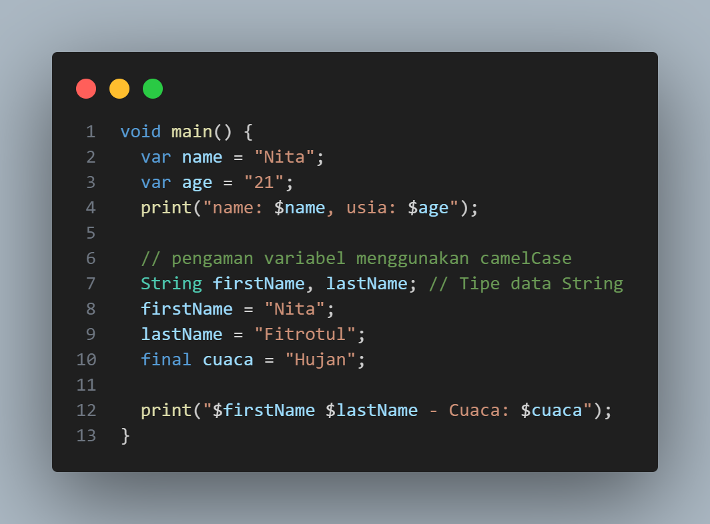

Output

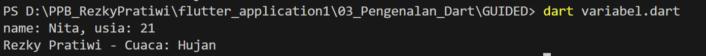

## B. Statement Control
Bagian ini memperkenalkan kontrol alur program menggunakan if-else, operator ternary, dan switch-case. Pada kode ini, program mengecek apakah waktu sekarang (now) berada di antara waktu buka (open) dan tutup (close). Selain itu, penggunaan switch memungkinkan pengecekan beberapa kasus pada variabel nilai.

Input

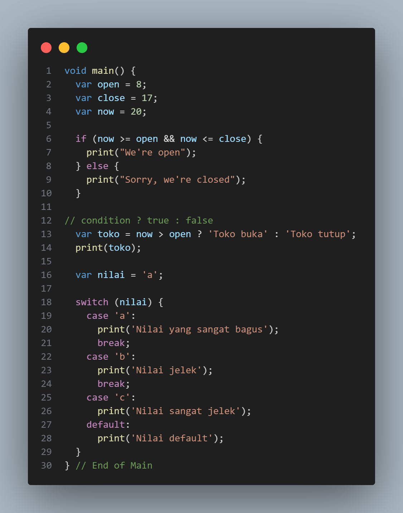

Output

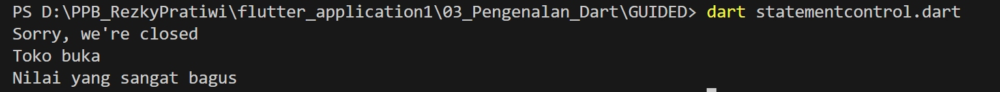

## C. Loop
Di sini kita mempelajari dua jenis loop, yaitu for dan while. Loop for akan mengulang dari 0 hingga kurang dari 5, sedangkan loop while akan terus mengulang sampai kondisi terpenuhi (dalam hal ini, sampai nilai i lebih besar dari 5).

Input

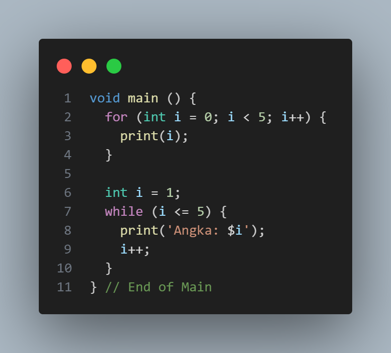

output

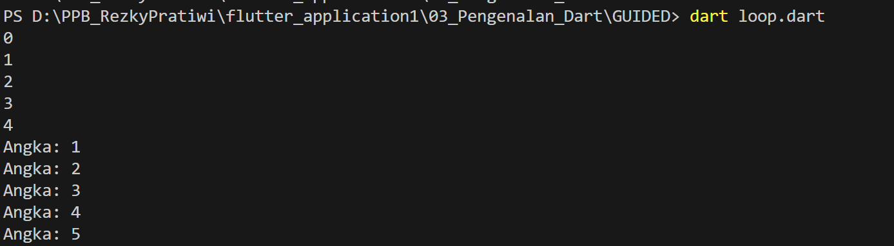

## D. List
Pada bagian ini, kita belajar tentang tipe data List di Dart. Ada dua jenis list yang diperkenalkan: list dengan panjang tetap (fixedList) dan list yang dapat diubah ukurannya (growableList). Pada kode ini, kita melihat bagaimana cara menambah dan menghapus elemen dari list.

Input

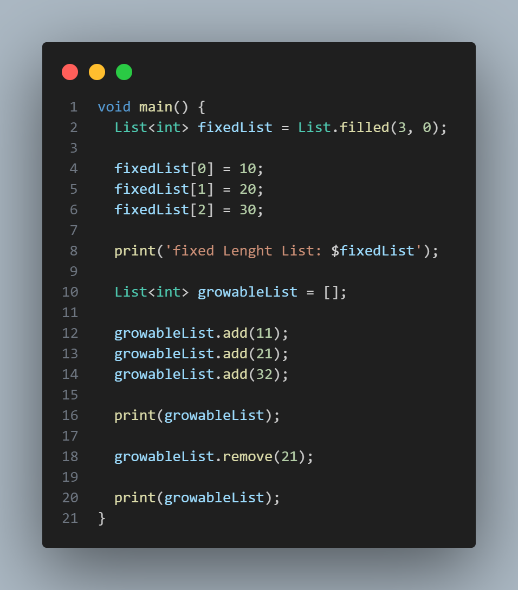

output

## E. Fungsi
Fungsi adalah blok kode yang dapat dipanggil untuk menjalankan tugas tertentu. Pada contoh ini, terdapat dua fungsi: cetakPesan untuk mencetak sebuah pesan, dan perkalian untuk mengembalikan hasil perkalian dua angka.

Input

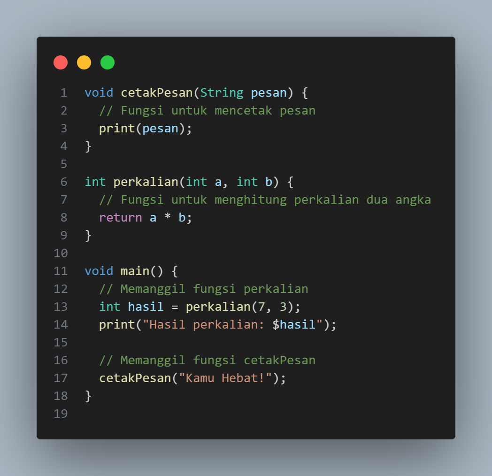
output

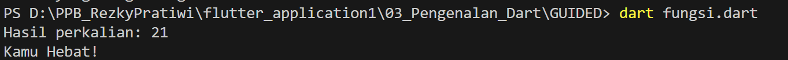

## GUIDED
### Soal 1

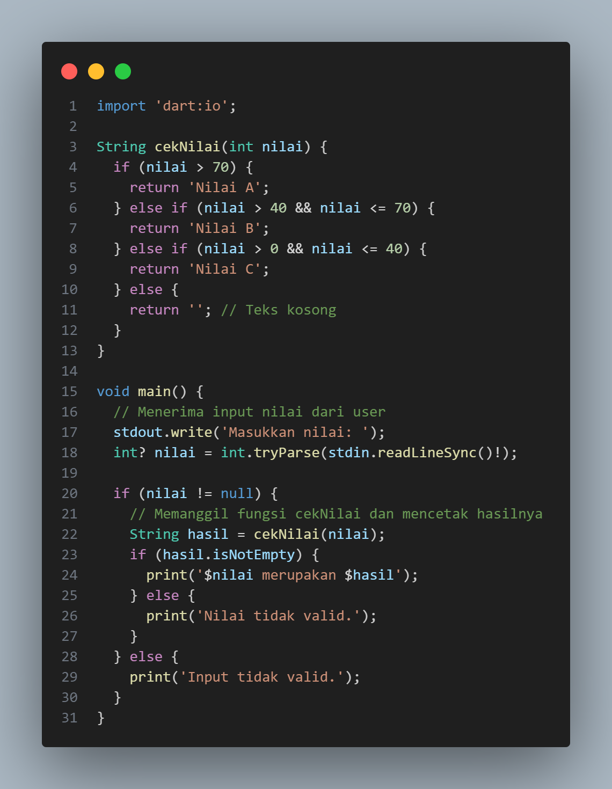

output

.png)>

### soal 2

Input

output

.png)

### Soal 3

input 

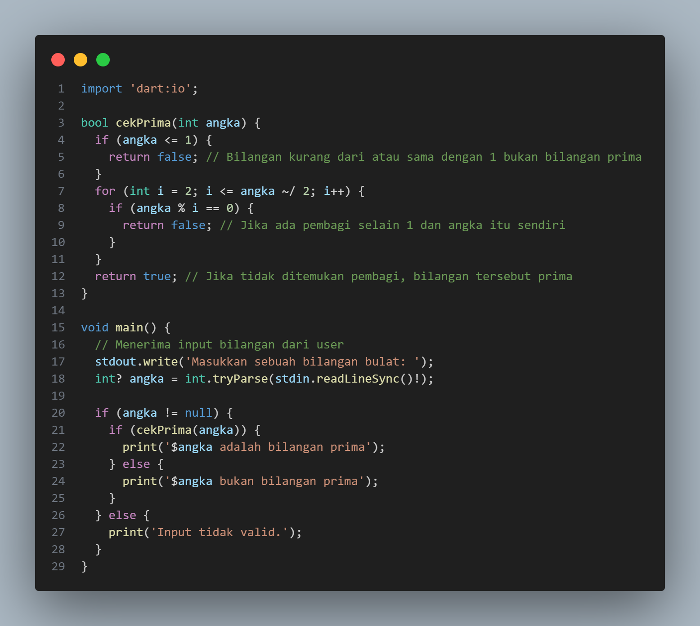

output

.png)

